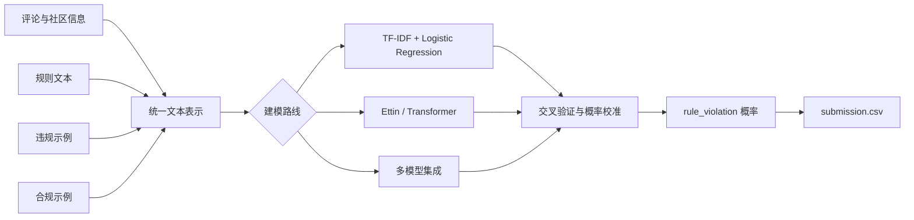
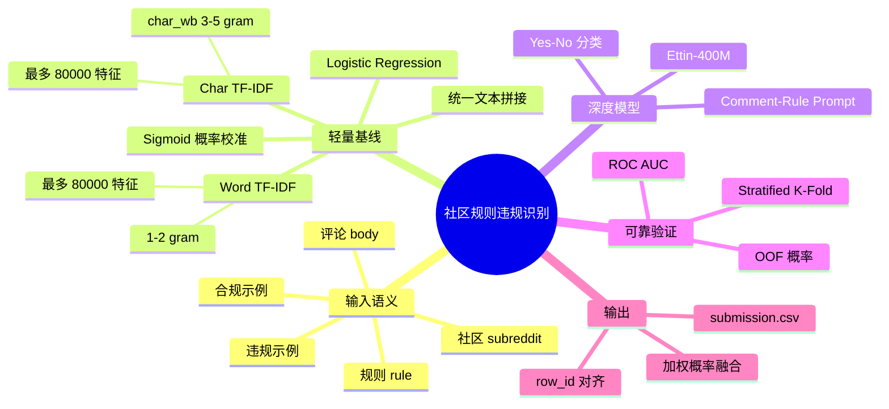
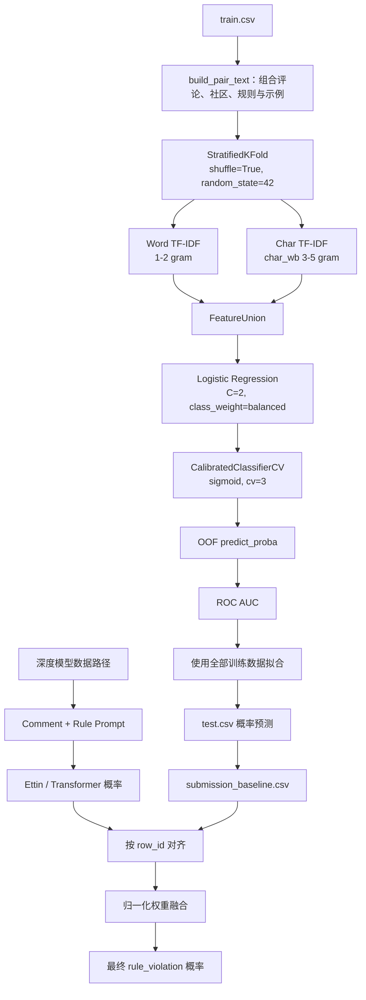

# Jigsaw Agile Community Rules

[](https://www.kaggle.com/competitions/jigsaw-agile-community-rules)
[](https://colab.research.google.com/github/mingzhuoFUN/jigsaw-agile-community-rules/blob/main/notebooks/verified_ettin_colab.ipynb)
[](https://www.python.org/)

面向社区规则理解的文本分类系统。项目将评论、社区、规则文本及正反示例组织为统一输入，通过可靠的验证设计、稀疏特征基线与 Transformer 模型输出违规概率。

## 项目概览

| 项目 | 内容 |
|---|---|
| 任务 | 判断 Reddit 评论是否违反给定社区规则 |
| 输入 | `body`、`subreddit`、`rule`、正例与反例 |
| 输出 | 每个 `row_id` 的 `rule_violation` 概率 |
| 评估指标 | ROC AUC |
| 核心难点 | 测试集包含训练阶段未出现的规则，需要基于规则语义泛化 |
| 推荐入口 | [在 Google Colab 中运行 Ettin 模型](https://colab.research.google.com/github/mingzhuoFUN/jigsaw-agile-community-rules/blob/main/notebooks/verified_ettin_colab.ipynb) |

## 系统流程



## 解决思路导图



## 训练与验证方法



## 数据概览

| 数据集 | 行数 | 列数 | 说明 |
|---|---:|---:|---|
| `train.csv` | 2,029 | 9 | 带 `rule_violation` 标签 |
| `test.csv` | 10 | 8 | 公开测试样例 |
| `sample_submission.csv` | 10 | 2 | 提交格式 |

训练标签分布较均衡：正类 1,031 条，负类 998 条。训练集包含 `No legal advice` 与 `No Advertising` 两类规则，模型需要利用规则文本与示例完成跨规则泛化。

## 建模方案

| 模块 | 实现 |
|---|---|
| 文本构造 | 评论、社区、规则、正反示例分区拼接 |
| 稀疏特征 | word 1–2 gram + `char_wb` 3–5 gram TF-IDF |
| 基线模型 | Logistic Regression + sigmoid calibration |
| 深度模型 | Ettin-400M 编码器 |
| 验证 | Stratified K-Fold AUC，并扩展规则/社区留出验证 |
| 集成 | 多模型预测按 `row_id` 对齐后加权融合 |

## 快速开始

### Google Colab

点击下方按钮即可打开已配置的运行环境：

[](https://colab.research.google.com/github/mingzhuoFUN/jigsaw-agile-community-rules/blob/main/notebooks/verified_ettin_colab.ipynb)

在 Colab Secrets 中添加 `KAGGLE_API_TOKEN`，并确认 Kaggle 账号已接受竞赛规则。

### 本地环境

```powershell
python -m venv .venv
.\.venv\Scripts\Activate.ps1
python -m pip install -r requirements.txt
```

下载竞赛数据：

```powershell
.\download_data.ps1
```

运行数据分析与基线训练：

```powershell
$env:PYTHONIOENCODING='utf-8'
python src/eda.py
python src/train_baseline.py
```

主要输出：

- `outputs/submission_baseline.csv`
- `outputs/oof_baseline.csv`
- `outputs/metrics_baseline.json`

## 项目结构

```text
notebooks/                 # Colab 训练入口
configs/                   # 模型与训练配置
scripts/                   # Notebook 构建及训练编排
src/
  first_place/             # 数据构造与集成模块
  eda.py                   # 探索性数据分析
  train_baseline.py        # TF-IDF 基线
tests/                     # 数据、指标与融合逻辑测试
```

## 工程亮点

- 将规则文本与正反示例作为一等输入，支持未见规则泛化。
- 同时提供轻量基线与 GPU 深度模型路径，便于快速验证和扩展。
- 预测按 `row_id` 严格对齐，降低多模型融合时的数据错位风险。
- Colab、Kaggle Token、Google Drive 输出路径形成完整云端训练链路。

## 后续方向

- 按规则或社区进行留出验证，更贴近隐藏测试分布。
- 分别编码评论、规则与示例，并加入语义相似度特征。
- 对 TF-IDF、Transformer 与规则特征进行 rank averaging。
- 增加模型误差分析与分规则 AUC 可视化。
